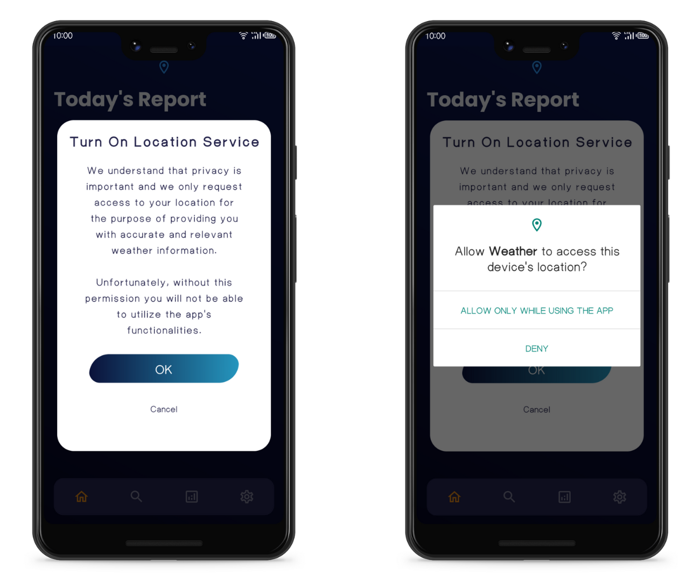
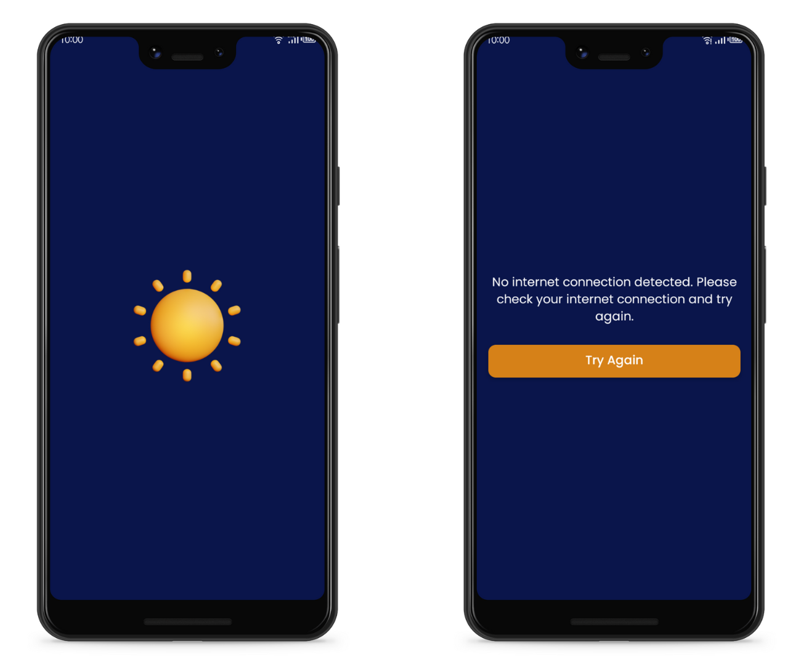
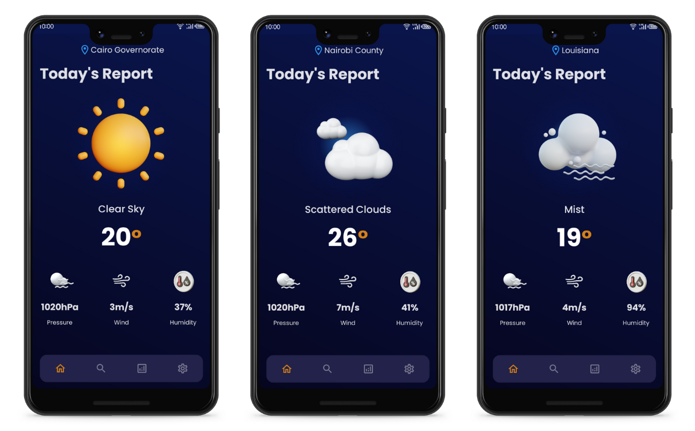
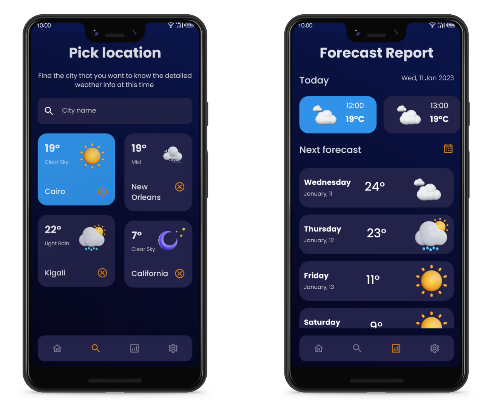

# WEATHER FORECAST APP
This is a weather forecast app that provides users with accurate and up-to-date weather information. The app retrieves data from OpenWeatherMap **(One Call API)** and allows users to search for the weather of a particular location, view the forecast report, utilize the current location to get weather forecast of that location, and save searched locations in local storage for later use.

## Important Note on App's Stability
This app is a work in progress and is currently in heavy development. Bugs may be present and any feedback or bug reports are welcome.
## Technologies Used

* **Jetpack Compose:** A modern UI toolkit for building native Android apps
* **Jetpack Navigation:** A library for building navigation on Android
* **Room:** A library for providing local data storage on Android
* **Hilt:** A dependency injection library for Android
* **OpenWeatherMap API:** A weather data API (One Call API) to retrieve weather data for a particular location
* **geocoder:** A library for converting location coordinates to location names and vice versa
* **Google Play's Location Library:** A library for retrieving the current location of the device
* **Kotlin Coroutines:** A library for asynchronous programming
* **GSON:** A library for serializing and deserializing JSON data

## Permissions

The app requires the **"Access to Location"** permission in order to work. This permission is required to retrieve the current location of the device and get the weather forecast of that location. The app will prompt the user to grant this permission when the app is launched for the first time.

The app also requires an active **internet** connection to work and retrieve the weather data. If the user does not have an active internet connection, the app will display a message to the user and will not proceed further. The user will need to click the **"Try Again"** button to try again.

## Features
* Search for the weather for a particular location
* Utilize user's current location to get weather forecast of that location
  

* View the forecast report for a location
* Save searched locations in local storage for later use  

  
### Known Issues
If the user clicks "Deny & Don't Ask Again" when prompted for the "Access to Location" permission, they will not be able to proceed further in the app and will need to restart the app to grant the permission.